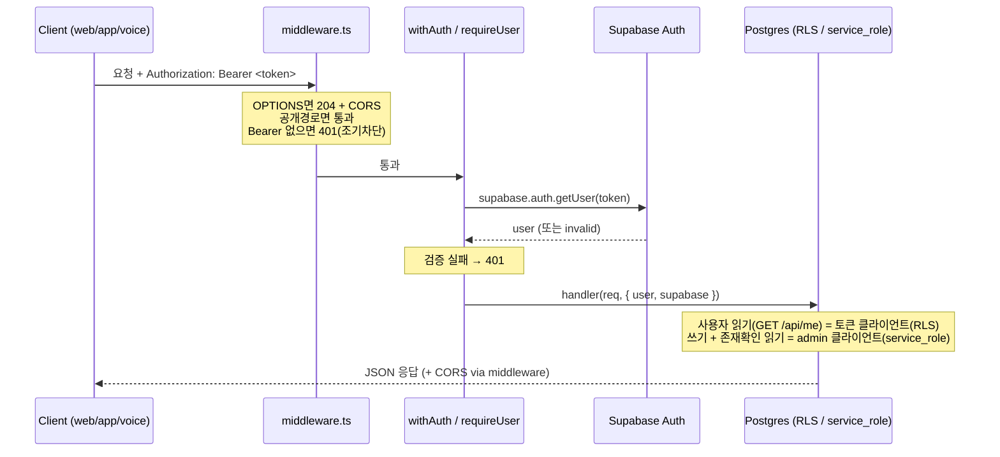

# Backend 아키텍처

Molly의 **제어 플레인(control plane)**. 인증·프로필·온보딩을 담당하는 순수 API 서버다. UI는 없으며, 실시간 오디오는 다루지 않는다(③ moly-voice 몫).

> 이 문서가 backend 구조의 **단일 출처(Single Source of Truth)**다. 루트 `README.md`는 진입점 요약만 두고, 엔드포인트·env·마이그레이션의 상세는 항상 이 문서에 기록한다.
>
> **문서 갱신 규칙**
> - 엔드포인트 추가/변경 → 이 문서의 [엔드포인트](#엔드포인트) 표 + 공개 경로면 `lib/auth/public-paths.ts` 갱신. (README는 건드릴 필요 없음)
> - env 키 추가 → [환경 변수](#환경-변수) 표 갱신.
> - 스키마 변경 → 새 마이그레이션 파일 + [데이터 모델](#데이터-모델--마이그레이션) 갱신.

---

## 1. 개요 / 역할

- **순수 API 서버.** 모든 클라이언트(웹·앱·voice)가 Supabase access token을 `Authorization: Bearer <token>`로 보낸다. **Bearer 전용** — 쿠키 세션 없음.
- **로그인(토큰 발급)은 백엔드가 하지 않는다.** 프론트가 Supabase SDK로 직접 처리하고, 백엔드는 받은 토큰을 `supabase.auth.getUser(token)`로 **검증만** 한다.
- **canonical 유저 식별자** = `auth.users.id`(JWT `sub`, uuid). 모든 보호 경로가 이 값만 신원으로 사용한다.
- 헬스체크만 공개, 나머지는 전부 토큰 보호.

## 2. 기술 스택

| 항목 | 값 |
|---|---|
| 프레임워크 | Next.js 15 (App Router) — **API Route Handler 전용**, 실 UI 없음 |
| 언어 | TypeScript (`strict`), `moduleResolution: bundler` |
| 데이터 SDK | `@supabase/supabase-js` (유일한 비프레임워크 의존성) |
| 런타임 | Node.js (admin 클라이언트를 쓰는 라우트는 `export const runtime = "nodejs"` 고정) |
| 경로 별칭 | `@/*` → `./*` (`@/lib/...`, `@/types/...`) |
| 스크립트 | `dev` / `build` / `start` / `lint` / `typecheck`. 테스트 프레임워크 없음 |

## 3. 디렉터리 구조

```
backend/
├── middleware.ts              # /api/* 진입: CORS + Bearer 조기 차단(보안경계 아님)
├── app/
│   ├── layout.tsx             # App Router 요건 충족용(실 UI 아님)
│   └── api/
│       ├── health/route.ts            # GET  공개
│       ├── me/route.ts                # GET(RLS 읽기) / DELETE(admin)
│       ├── me/nickname/route.ts       # PATCH(admin)
│       └── onboarding/complete/route.ts # POST(admin, 멱등)
├── lib/
│   ├── cors.ts                # CORS 헤더 중앙 적용(echo origin, 절대 '*' 아님)
│   ├── auth/
│   │   ├── public-paths.ts    # 공개 허용목록(/api/health 만)
│   │   ├── require-user.ts     # Bearer → getUser 검증 → { user, supabase }
│   │   └── with-auth.ts        # withAuth(): 보호 라우트 래퍼(보안 권위)
│   ├── profile/nickname.ts    # normalizeNickname() 검증(단일 출처)
│   └── supabase/
│       ├── admin.ts            # service_role 클라이언트(RLS 우회)
│       └── token.ts            # anon + Bearer 클라이언트(RLS 적용)
├── types/profile.ts           # Profile 타입 + PROFILE_COLUMNS
└── supabase/migrations/       # 0001 ~ 0004 SQL
```

## 4. 요청 수명주기 (2계층 인증)



- **1계층 — `middleware.ts`** (`matcher: ["/api/:path*"]`): ⓐ OPTIONS 프리플라이트 204, ⓑ **모든 응답에 CORS 단일 적용**(브라우저는 중복 `Access-Control-Allow-Origin`을 거부하므로 한 곳에서만), ⓒ 비공개 경로에 `Bearer ` 헤더가 없으면 즉시 401. **네트워크 없는 조기 차단일 뿐, 보안 경계가 아니다** — 가짜 토큰도 여기는 통과한다.
- **2계층 — `withAuth` / `requireUser`** (`lib/auth/`): **실제 보안 권위.** `requireUser`가 토큰을 추출해 토큰 클라이언트를 만들고 `supabase.auth.getUser(token)`로 **항상 Supabase Auth 서버에 검증**한다(JWT를 로컬에서 신뢰하지 않음). 성공 시 `{ user, supabase }`를 핸들러에 넘기고, 실패 시 401.
  - ⚠️ 모든 비공개 라우트는 **반드시 `withAuth`로 감싼다.** 깜빡하면 그 라우트는 무방비가 된다(미들웨어는 보호가 아님).

## 5. ★ 데이터 접근 규칙 (가장 중요)

profiles의 RLS 정책은 `0004` 이후 **SELECT(본인)만** 존재하고 INSERT/UPDATE/DELETE 정책이 없다. 따라서:

| 작업 | 사용하는 클라이언트 | 이유 |
|---|---|---|
| 사용자 대면 읽기 (`GET /api/me`) | **토큰 클라이언트 (RLS)** | 최소 권한. `profiles_select_own`으로 본인 row만 |
| 모든 쓰기 (INSERT/UPDATE/DELETE) | **admin 클라이언트 (service_role)** | RLS에 쓰기 정책이 없어 anon/authenticated 역할로는 불가 |
| 쓰기에 수반되는 존재확인 읽기 | **admin 클라이언트** | 예: `onboarding/complete`의 멱등성 체크는 admin으로 읽는다 |

> **"읽기는 무조건 RLS"가 아니다.** 사용자 대면 단건 조회(`GET /api/me`)만 RLS를 거치고, 쓰기 경로에 딸린 존재확인 읽기는 admin을 쓴다.

> 🔒 **쓰기 보안은 DB(RLS)가 아니라 앱 코드의 규율에 전적으로 의존한다.** admin 클라이언트는 RLS를 우회하므로, 모든 쓰기는 반드시 **검증된 `user.id`로만**(`eq("id", user.id)` / `insert({ id: user.id })`) 수행해야 한다. 외부 입력 id를 admin에 넘기면 **IDOR 취약점**이 된다(`lib/supabase/admin.ts`의 경고 참조).

### Supabase 클라이언트 2종

| | `lib/supabase/admin.ts` | `lib/supabase/token.ts` |
|---|---|---|
| 키 | `SUPABASE_SERVICE_ROLE_KEY` | `SUPABASE_ANON_KEY` |
| RLS | **우회** | **적용** (`Authorization: Bearer`로 `auth.uid()` 작동) |
| env 검증 | 있음(누락 시 throw) | 없음(non-null 단언) |
| 용도 | 쓰기 / 존재확인 / 회원탈퇴 | `requireUser`의 토큰 검증, `GET /api/me` 읽기 |

## 6. 엔드포인트

| 메서드 | 경로 | 공개 | 클라이언트 | 용도 / 주요 응답 |
|---|---|---|---|---|
| GET | `/api/health` | ✅ | — | 헬스체크 `{ status: "ok", ts }` |
| GET | `/api/me` | 🔒 | 토큰(RLS) | 본인 profile 조회. `200 {profile}` / `200 {profile:null}`(온보딩 전) |
| DELETE | `/api/me` | 🔒 | admin | 회원탈퇴(`auth.admin.deleteUser`). CASCADE로 도메인 데이터 삭제. `200 {success:true}` |
| PATCH | `/api/me/nickname` | 🔒 | admin | 닉네임 변경. `200 {profile}` / `400` / `404`(온보딩 전) |
| POST | `/api/onboarding/complete` | 🔒 | admin | 온보딩 완료(profile INSERT). `201 {profile}` / `409 {error:"Already onboarded", profile}`(멱등) / `400` |

**라우트 공통 패턴**: `withAuth`로 래핑 → (쓰기면) `try { body = await req.json() } catch { 400 }` → `normalizeNickname()` → `400` → admin 작업 + `eq/insert id = user.id`.

## 7. 데이터 모델 / 마이그레이션

Supabase 대시보드 **SQL Editor**에서 `0001 → 0002 → 0003 → 0004` 순서로 실행한다. (`0002`는 `postgres` 권한으로 실행돼야 트리거가 동작했음 — 단, `0004`가 이를 되돌린다.)

| 파일 | 내용 |
|---|---|
| `0001_init.sql` | `profiles`(id, display_name, locale, created_at), `conversations`, `messages` 생성 + 인덱스 + RLS(`FOR ALL` 본인 정책) |
| `0002_handle_new_user.sql` | 가입 시 profile 자동생성 트리거. **→ `0004`가 되돌림** |
| `0003_pgvector.sql` | `create extension vector` — mem0 메모리용 |
| `0004_profiles_nickname.sql` | **온보딩 모델로 전환**: 자동생성 트리거 제거, `display_name→nickname`, `locale` 제거, `updated_at` 추가, `nickname NOT NULL` + `profiles_nickname_len`(트림 1~20자) 체크, `set_updated_at` 트리거, profiles 정책을 **SELECT 전용**(`profiles_select_own`)으로 교체 |

**`0004` 적용 후 유효 스키마:**
- `profiles`(id uuid PK→auth.users, nickname, created_at, updated_at) — RLS: SELECT(본인)만. 쓰기는 service_role.
- `conversations`, `messages` — 스키마/인덱스/RLS는 존재하나 **현재 API에서 사용하지 않음**(회원탈퇴 시 CASCADE 대상으로만 의미).
- mem0가 자동 생성하는 벡터 테이블(pgvector).

> ⚠️ 현재 동작을 알려면 `0001`→`0004`를 순서대로 읽어야 한다(`0002`는 `0004`가 되돌리고, `0004`가 `0001`의 profiles 정책을 재작성하므로 파일명만 봐서는 최종 상태를 알 수 없다).

## 8. 컨벤션 (앞으로 따를 것)

- **닉네임 규칙은 3곳이 동기화돼야 한다**(단일 규칙, 세 군데 표현): `lib/profile/nickname.ts`의 `normalizeNickname` ↔ DB 체크 제약 `profiles_nickname_len` ↔ `types/profile.ts`의 `Profile`. 규칙 변경 시 셋 다 수정.
- **profile 조회 컬럼은 `PROFILE_COLUMNS`**(`types/profile.ts`)를 재사용한다(컬럼 셋 단일 출처).
- 공개 경로는 `lib/auth/public-paths.ts` 한 곳에만 추가한다(미들웨어가 공유).

### ★ 런북 — 새 보호 엔드포인트 추가하는 법

1. `app/api/<경로>/route.ts` 생성.
2. admin 클라이언트를 쓰면 `export const runtime = "nodejs"` 추가.
3. 핸들러를 **`withAuth(async (req, { user, supabase }) => …)`** 로 감싼다.
4. **읽기**는 토큰 클라이언트(`supabase`), **쓰기**는 `createSupabaseAdminClient()`를 쓰고 **반드시 `eq("id", user.id)` / `insert({ id: user.id })`**.
5. 본문이 있으면 `req.json()` try/catch(400) + `normalizeNickname` 등으로 검증.
6. 공개 경로면 `lib/auth/public-paths.ts`에 추가.
7. 이 문서의 [엔드포인트](#엔드포인트) 표 갱신. (CORS·미들웨어 차단은 자동.)

## 9. 환경 변수

| 키 | 설명 |
|---|---|
| `SUPABASE_URL` | Supabase 프로젝트 URL |
| `SUPABASE_ANON_KEY` | 공개(anon/publishable) 키 — 토큰 클라이언트용 |
| `SUPABASE_SERVICE_ROLE_KEY` | service_role(secret) 키 — admin 클라이언트용. **절대 클라이언트 노출 금지** |
| `CORS_ALLOWED_ORIGINS` | 허용 origin(쉼표 구분). **정확한 origin만**(trailing slash·경로 금지) |

## 10. 개선 백로그 (기록만 — 이번 문서화에서는 코드 미변경)

향후 리팩토링 후보. 지금은 동작 보존을 위해 손대지 않는다.

- 라우트 간 **중복 로직**: `req.json()` try/catch → `normalizeNickname` → admin 클라이언트 생성 블록이 nickname/onboarding에 거의 동일하게 반복. 공용 헬퍼(`parseNickname`, `getAdmin`)로 추출 여지.
- **에러 응답 형식 불일치**: `GET /api/me`는 `{error:"Database error"}`로 마스킹하나, DELETE/PATCH/POST는 `{error: error.message}`로 **DB 원문 노출**. 응답/에러 헬퍼로 통일 + 내부 메시지 비노출 권장.
- admin 쓰기 라우트는 `requireUser`가 만든 **토큰 클라이언트를 인증 검증에만 쓰고 데이터 작업엔 쓰지 않는다**(매 요청 토큰 클라이언트 1회 생성 비용).
- **주석 언어 혼재**: 인프라/인증/CORS는 영어, 도메인/라우트/마이그레이션은 한국어.
- `token.ts`는 env를 non-null 단언으로만 사용(검증 없음) — `admin.ts`처럼 명시 검증 가능.
- **검증 라이브러리 부재**: 본문 파싱이 `as { nickname?: unknown }` 캐스트에 의존. zod 등 스키마 도입 여지.
- **테스트 없음**(`lint`/`typecheck`만).
